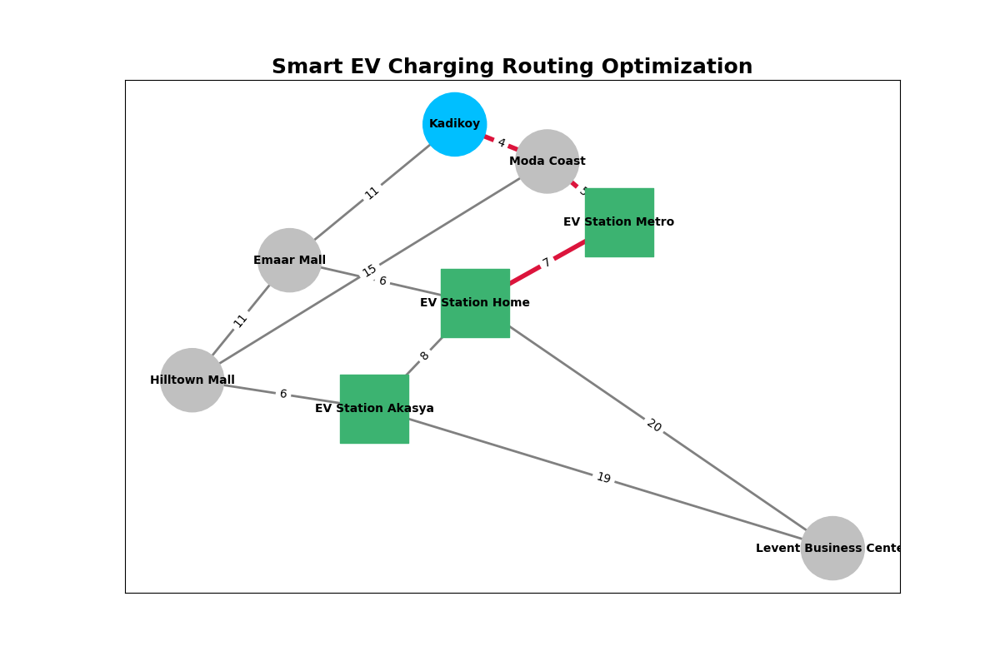

# Smart EV Charging Routing Optimization System

## Project Overview

This project focuses on optimizing electric vehicle (EV) charging station routing in smart cities using network optimization techniques.

The system:
- finds the shortest and most efficient route,
- considers traffic density,
- excludes unavailable charging stations,
- checks battery feasibility.

The project simulates the routing logic used in real-world EV charging applications.

---

## Real-World Problem Context

As electric vehicle adoption increases worldwide, finding an efficient charging station has become an important challenge for smart transportation systems.

Drivers may experience:
- long travel distances,
- traffic congestion,
- unavailable charging stations,
- battery limitations.

This project provides a smart routing model that helps optimize EV charging accessibility in urban environments.

---

## Selected Algorithm	

### Shortest Path Algorithm

The project uses a shortest path optimization approach to determine the most efficient route between the driver’s location and available EV charging stations.

The algorithm minimizes:

- travel distance,
- traffic-related cost,
- overall transportation cost.

This approach helps improve routing efficiency and supports smarter urban transportation planning.

---

## Technologies Used

- Python
- NetworkX
- Pandas
- Matplotlib
- SciPy

---

## Features

- Shortest path optimization
- Traffic-aware routing
- Dynamic charging station availability
- Battery feasibility check
- Network visualization

---
## Network Visualization


The highlighted red path represents the optimized route selected by the system based on traffic density and transportation cost.

## Managerial Interpretation

The optimization results demonstrate how smart routing systems can improve EV c$

By minimizing travel distance and traffic-related costs, the system helps:
- reduce energy consumption,
- decrease travel time, 
- improve charging station accessibility,
- support smart city transportation planning.

The project also demonstrates how network optimization models can support managerial decision-making in intelligent transportation systems.

---

## Dataset Structure

| Source | Target | Distance | Traffic |
|---|---|---|---|
| Kadikoy | Moda Coast | 2 | 2 |
| Kadikoy | Emaar Mall | 8 | 3 |
| Moda Coast | EV Station Metro | 3 | 2 |

---

## Project Structure

```text
smart-ev-routing-system/

│── README.md
│── requirements.txt

│── data/
│     └── network_data.csv

│── src/
│     └── solution.py

│── notebooks/
│     └── analysis.ipynb

│── results/
│     ├── highlighted_route.png
│     └── solution_output.txt

│── references/
│     └── references.md
```

## References

- NetworkX Documentation: https://networkx.org/
- Pandas Documentation: https://pandas.pydata.org/
- Matplotlib Documentation: https://matplotlib.org/
- SciPy Documentation: https://scipy.org/
- Lecture Slides (MIS Network Optimization)
